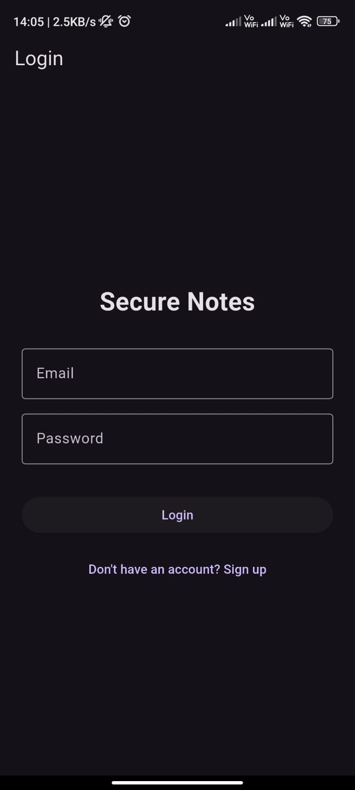
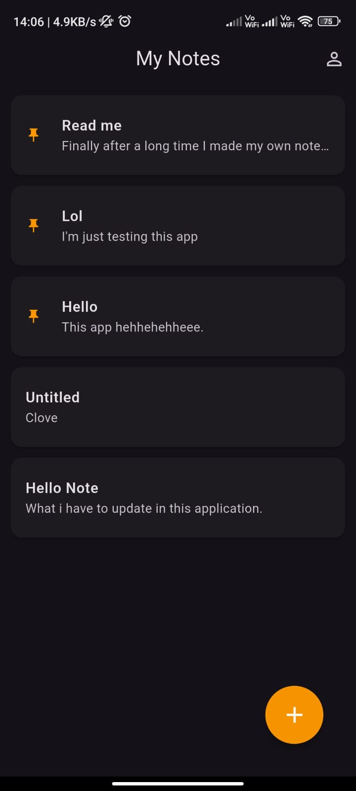
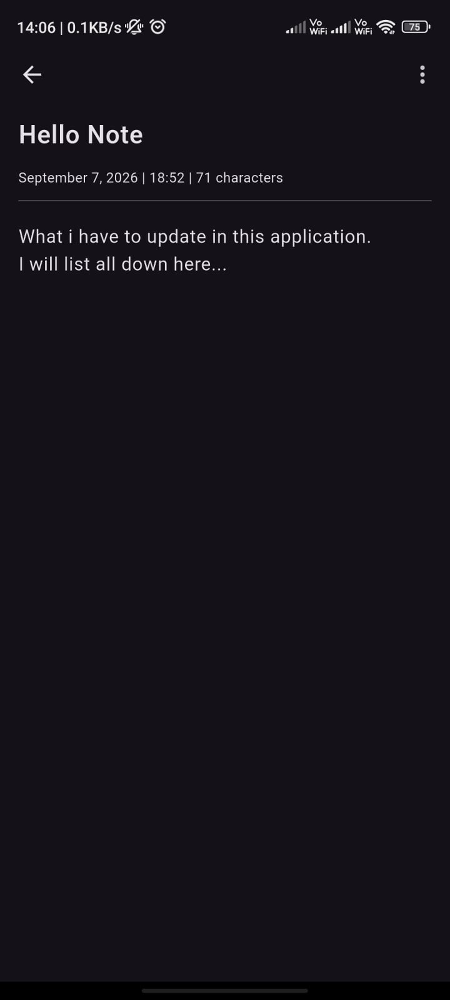

# Secure Notes — Flutter App

A cross-platform notes app built with Flutter, featuring secure authentication, pinned notes, swipe gestures, and a custom UI — built as a full-stack learning project pairing mobile development with cybersecurity fundamentals.

This is the **Flutter frontend**. It connects to a separate Node.js/Express/MongoDB backend: [secure-notes-backend](https://github.com/kaneki422/secure-notes-backend).

## Features

- **Secure authentication** — signup and login backed by JWT tokens and hashed passwords (via the companion backend)
- **Persistent sessions** — stays logged in across app restarts using local secure storage, until the user manually logs out
- **Full note CRUD** — create, edit, and delete notes with a distraction-free full-screen editor
- **Pinned notes** — pin up to 3 notes to the top of the list, enforced by the backend (not just the UI)
- **Gesture-based interactions** — swipe right to delete, swipe left to pin/unpin, long-press to multi-select and bulk delete
- **Custom note backgrounds** — pick a background color per note from a built-in palette
- **Light/dark theme support** — follows the system theme automatically
- **Profile screen** — view account email, total note count, and manage the account (logout, delete account)
- **Pull-to-refresh** — refresh the notes list with a swipe down

## Tech Stack

- **Flutter** (Dart) — cross-platform UI framework
- **http** — REST API communication with the backend
- **shared_preferences** — persistent local storage for the auth session
- **intl** — date/time formatting

## Screenshots

| Login | Notes List | Note Editor | Profile |
|---|---|---|---|
|  |  |  |  |

## Getting Started

### Prerequisites

- [Flutter SDK](https://docs.flutter.dev/get-started/install) installed

The backend is already deployed and live, so no local backend setup is required to try the app.

### Installation

```bash
git clone https://github.com/kaneki422/secure-notes-app.git
cd secure-notes-app
flutter pub get
```

### Running the app

```bash
flutter run
```

The app is pre-configured to connect to the live backend at:
```
https://secure-notes-backend-u6fz.onrender.com/api
```

If you'd rather run your own backend locally, see [secure-notes-backend](https://github.com/kaneki422/secure-notes-backend) for setup instructions, then update `baseUrl` in `lib/services/api_service.dart` accordingly.

## Project Structure

```
lib/
├── main.dart                  # App entry point, theme, startup/session check
├── screens/
│   ├── login_screen.dart
│   ├── signup_screen.dart
│   ├── notes_screen.dart      # Main notes list, pin/delete/multi-select logic
│   ├── note_editor_screen.dart# Full-screen note editor
│   └── profile_screen.dart    # Account info, logout, delete account
└── services/
    └── api_service.dart       # All backend API calls
```

## Security Notes

- Passwords are never handled directly by this app — they're sent to the backend, which hashes them before storage.
- The JWT auth token is stored locally and attached to every authenticated request; it's cleared from storage on logout.
- Pin-limit and note ownership rules are enforced server-side, not just in the UI, so they can't be bypassed by directly calling the API.

## Author

Built by [Rohit Raj](https://github.com/kaneki422) as a personal project combining a cybersecurity background with full-stack mobile development.